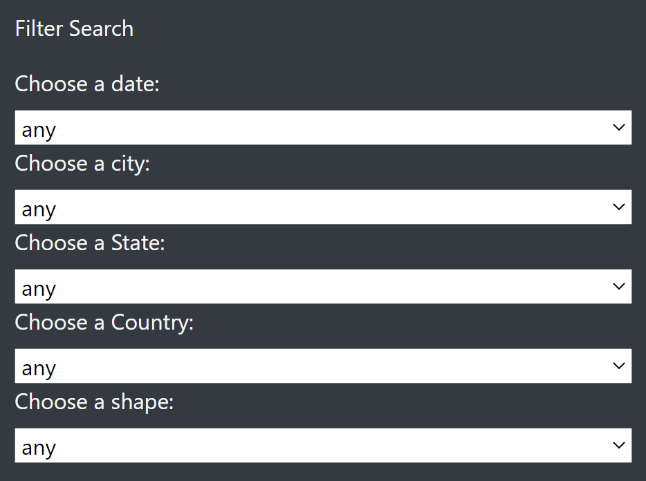
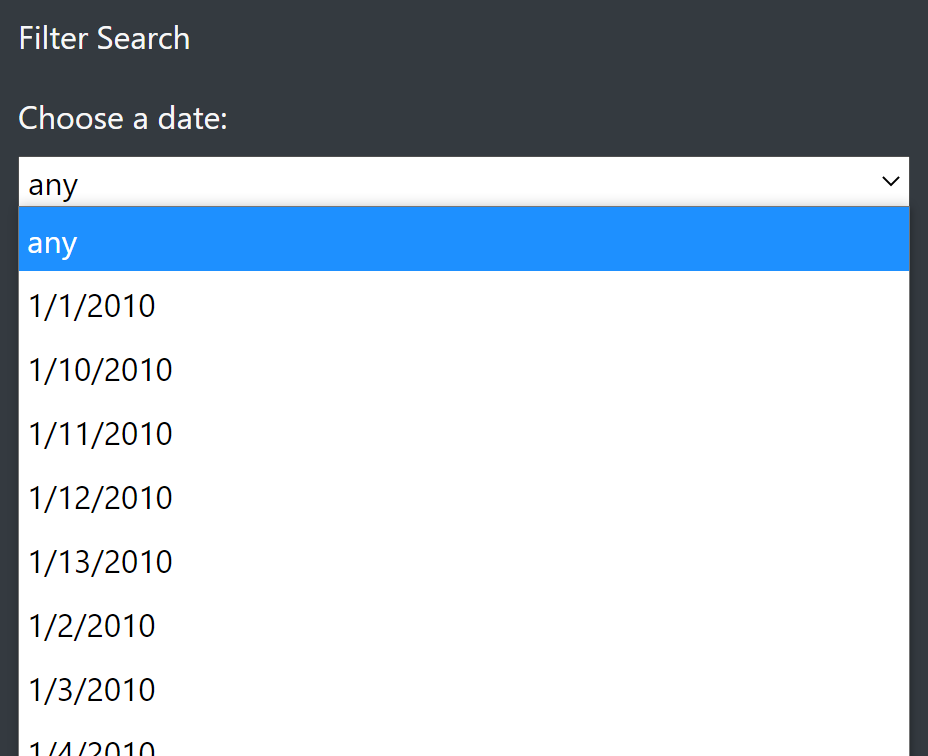
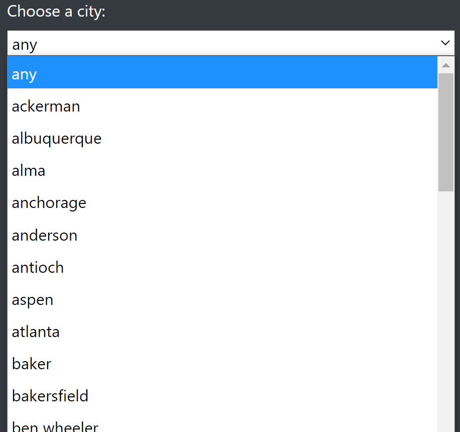
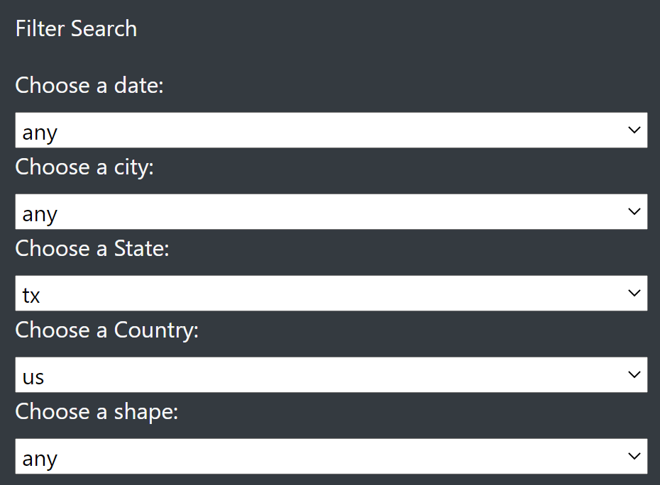
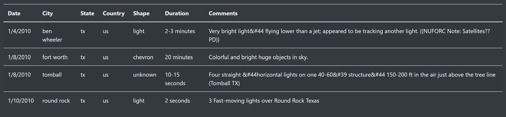

# UFOs

## Overview

- The purpose of this project is to deliver a web page to facilitate the presentation and filtering of a database of UFOs sightenings in USA and Canada

## Results

- The original input for was based on text input, but it was replaced with comboboxes.
- These combo boxes are updated as the page is loaded and the options are automatically adapted to the data in data.js.

### Date Example

### City Example

### Filter Example

### Data Example

## Summary

### Drawbacks attended

- The original input form was prone to input errors as the user had to type the filters.
- To avoid the user input error the webpage and app.js was modified to replace the text inputs by dropboxes.
- The options in the dropboxes are automatically updated using the data in data.js when the page is loaded using:
  - Arrays
  - Set constructor
  - D3

### Further development recomendations

- Date selection is akward as is ordered as text it should be reordered as date.
- A good graph showing the sightings dates could help to understand the data.
